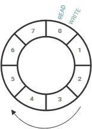

Ring Buffer
================================================================================

Welcome to the landing page of Ring Buffer library.

Ring buffer also known as circular buffer or queue buffer is a data structure 
that uses a fixed-size buffer as if it were connected end-to-end (in a circle).

__NOTE:__ Ring buffer is FIFO.

VS Code CMake Installation
================================================================================

Follow this 
[tutorial](https://computingonplains.wordpress.com/building-c-applications-with-cmake-and-visual-studio-code/) 
for how to install and configure CMake project in VS code.

APIs Usage
================================================================================

### ring_cfg.h

This header file is used specify size of the ring buffer, data type of the ring 
buffer and user define NULL pointer.

__NOTE:__ Update or add configuration based to needs.

### ring_buffer.h

* __CreateRingBuffer()__ - Takes normal array and covert it into ring buffer.
* __RingInsert()__       - Adds data into the buffer.
* __RingRemove()__       - Removes the front element from the buffer.
* __RingUsedCount()__    - Returns number of elements present in the buffer.
* __RingClear()__        - Reset the ring buffer (Starts buffer from the 0).
* __RingFull()__         - Indicates whether ring is full or not.
* __RingEmpty()__        - Indicates whether ring is empty or not.

__NOTE:__ This implementation reserves one space for the checking purpose whether
ring is full or not. If we don't want to waste one space for that, we can use 
ring buffer size to verify whether ring is full or not. 
                            